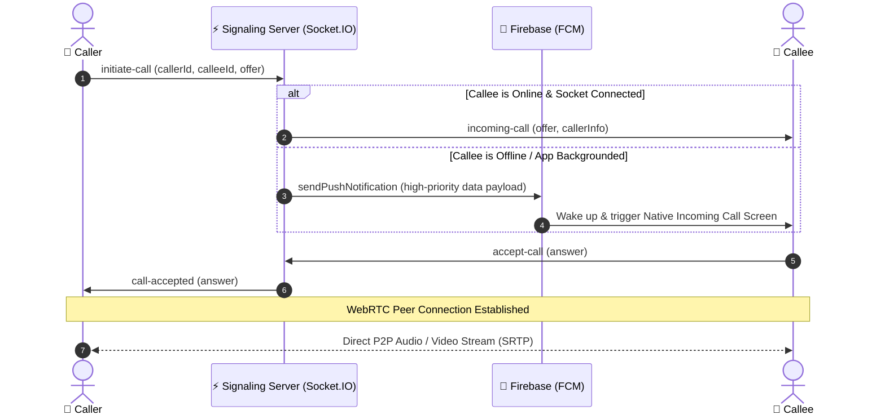

<p align="center">
  
</p>

<h1 align="center">CallVerse</h1>

<p align="center">
  <strong>Next-Generation, Ultra-Secure, Peer-to-Peer Voice & Video Calling</strong>
</p>

<p align="center">
  <em>Available on Web, Android, and Desktop with zero latency audio/video streams.</em>
</p>

<p align="center">
  <a href="https://github.com/Adityaprajapati18/crypto-caller/stargazers"></a>
  <a href="https://github.com/Adityaprajapati18/crypto-caller/network/members"></a>
  <a href="https://github.com/Adityaprajapati18/crypto-caller/blob/main/LICENSE"></a>
  <a href="https://react.dev/"></a>
  <a href="https://webrtc.org/"></a>
  <a href="https://socket.io/"></a>
  <a href="https://capacitorjs.com/"></a>
  <a href="https://www.electronjs.org/"></a>
</p>

<p align="center">
  <a href="#-key-features">Key Features</a> •
  <a href="#-architecture">Architecture</a> •
  <a href="#-supported-platforms">Platforms</a> •
  <a href="#-getting-started">Getting Started</a> •
  <a href="#-build--deployment">Build & Deploy</a> •
  <a href="#-contributing">Contributing</a>
</p>

---

## 🌟 Highlights

<table>
  <tr>
    <td width="50%">
      <h3>🔐 Direct P2P Encryption</h3>
      <p>Audio and video data streams flow directly between peers using <strong>WebRTC</strong> with end-to-end media encryption, bypassing centralized media servers for maximum privacy and low latency.</p>
    </td>
    <td width="50%">
      <h3>⚡ Instant Signaling</h3>
      <p>Powered by <strong>Socket.IO</strong> for near-instantaneous call negotiation, ICE candidate handshakes, caller availability detection, and session management.</p>
    </td>
  </tr>
  <tr>
    <td width="50%">
      <h3>📲 Native Mobile Experience</h3>
      <p>Native Android Capacitor bridge featuring custom background call receivers, full-screen incoming call UI, native ringtone playback, and hardware audio routing.</p>
    </td>
    <td width="50%">
      <h3>🔔 Reliable Push Notifications</h3>
      <p>Integrated with <strong>Firebase Cloud Messaging (FCM)</strong> to wake up backgrounded or killed devices when a call arrives.</p>
    </td>
  </tr>
</table>

---

## 🚀 Key Features

- [x] **P2P Audio & Video Calls**: Crystal-clear, adaptive WebRTC media streams with mute and camera toggle.
- [x] **Cross-Platform Compatibility**: Run natively as an Android APK, Desktop App (Windows/macOS/Linux), or Responsive Web App.
- [x] **Hardware Audio Routing**: Seamlessly switch between earpiece, speaker, and connected Bluetooth headsets on mobile.
- [x] **Deep Linking Support**: Direct call launch via deep URLs (`/call/:targetId`) that connect without user friction.
- [x] **Clean Authentication**: Effortless sign-in and identity verification with Firebase Auth.
- [x] **Sleek UI & Theming**: Modern glassmorphism aesthetic with seamless Dark/Light theme switching and reactive Zustand state management.
- [x] **Lightweight Signaling Server**: High-performance Node.js & SQLite/Turso database for quick user lookup and token persistence.

---

## 🏛️ Architecture

CallVerse uses an event-driven architecture combining WebRTC for peer communication and Socket.IO for signaling:



---

## 📱 Supported Platforms

| Platform | Runtime | Distribution Format | Status |
| :--- | :--- | :--- | :---: |
| **Android** | Capacitor Native Bridge | `.apk` / Google Play | 🟢 Fully Supported |
| **Web Browser** | Vite + React 19 SPA | Modern Browsers | 🟢 Fully Supported |
| **Windows** | Electron | `.exe` / NSIS Installer | 🟢 Fully Supported |
| **macOS** | Electron | `.dmg` | 🟢 Fully Supported |
| **Linux** | Electron | `AppImage` / `.deb` | 🟢 Fully Supported |

> 📦 **Quick Android Test**: You can find the pre-built APK ready for testing in [`public/CallVerse-latest.apk`](public/CallVerse-latest.apk).

---

## 📂 Repository Layout

```
crypto-caller/
├── 📱 android/              # Native Android project with custom Capacitor plugins
│   ├── app/src/main/java/   # RingtonePlugin, AudioRoutePlugin, CallMessagingService
│   └── app/src/main/res/    # Native XML layouts for incoming call screens
├── 💻 electron/             # Electron entry points for desktop application
├── 🌐 public/               # Static assets, branding, and latest APK
├── ⚙️ server/                # Signaling and notification server
│   ├── index.js             # Socket.IO event handlers & Express API
│   ├── db.js                # SQLite / Turso persistence layer
│   └── package.json         # Server dependencies
├── ⚛️ src/                   # React 19 Frontend
│   ├── components/          # CallScreen, Dashboard, Auth, SplashScreen
│   ├── hooks/               # useWebRTC, usePushNotifications
│   ├── utils/               # Socket connectors and sound managers
│   └── store.js             # Global state (Zustand)
└── 📄 package.json          # Root workspace configuration
```

---

## 🛠️ Getting Started

### 1. Prerequisites
Ensure you have the following installed:
* **Node.js**: `v18.0.0` or newer
* **npm**: `v9.0.0` or newer
* *(Optional for Android)*: **Android Studio** & **JDK 17+**

### 2. Clone the Repository
```bash
git clone https://github.com/Adityaprajapati18/crypto-caller.git
cd crypto-caller
```

### 3. Client Setup
Install the frontend dependencies:
```bash
npm install
```

Configure your Firebase credentials in `src/firebase.js`:
```javascript
const firebaseConfig = {
  apiKey: "YOUR_FIREBASE_API_KEY",
  authDomain: "YOUR_PROJECT.firebaseapp.com",
  projectId: "YOUR_PROJECT_ID",
  storageBucket: "YOUR_PROJECT.appspot.com",
  messagingSenderId: "YOUR_SENDER_ID",
  appId: "YOUR_APP_ID"
};
```

### 4. Signaling Server Setup
```bash
cd server
npm install
```

Create a `.env` file in the `server` directory:
```env
PORT=5000
DATABASE_URL=file:local.db
# Optional: TURSO_AUTH_TOKEN=your_token
```

Start the signaling server:
```bash
npm run dev
```

### 5. Launch the Client
In a new terminal at the project root:
```bash
npm run dev
```
Open [http://localhost:5173](http://localhost:5173) in your browser.

---

## 📦 Build & Deployment

### 🖥️ Desktop (Electron)
```bash
# Run in development mode
npm run electron:dev

# Build for Windows
npm run electron:build:win

# Build for macOS / Linux
npm run electron:build
npm run electron:build:linux
```

### 🤖 Android
```bash
# Build web distribution and sync to Android
npm run build
npx cap sync android

# Open Android Studio to build APK or run on connected device
npx cap open android
```

---

## 🤝 Contributing

Contributions make the open-source community an inspiring place to learn, inspire, and create. Any contributions you make are **greatly appreciated**.

1. Fork the Project
2. Create your Feature Branch (`git checkout -b feature/AmazingFeature`)
3. Commit your Changes (`git commit -m 'feat: Add some AmazingFeature'`)
4. Push to the Branch (`git push origin feature/AmazingFeature`)
5. Open a Pull Request

---

## 📄 License & Legal Notice

This software is distributed under the terms of the **MIT License**. For complete terms, conditions, and permissions, please refer to the [`LICENSE`](LICENSE) file.

---

## 👤 Maintainer & Support

* **Project Lead**: [Aditya Prajapati](https://github.com/Adityaprajapati18)
* **Bug Reports & Feedback**: Please submit technical issues or feature proposals via the [GitHub Issue Tracker](https://github.com/Adityaprajapati18/crypto-caller/issues).
* **Contributions**: Pull requests adhere to standard open-source contribution guidelines.

<br>

<p align="center">
  <sub>Copyright &copy; 2026 Aditya Prajapati. All rights reserved.</sub>
</p>

